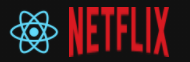

<h1 align="center">
  
</h1>

<p align="center">
  <a href="#-tecnologias">Tecnologias</a>&nbsp;&nbsp;&nbsp;|&nbsp;&nbsp;&nbsp;
  <a href="#-executando">Executando</a>&nbsp;&nbsp;&nbsp;|&nbsp;&nbsp;&nbsp;
  <a href="#-projeto">Projeto</a>
</p>

---

<p align="center">
    
    &nbsp;&nbsp;&nbsp;
    
</p>

<p align="center">
  
</p>

<br>

### 🚀 Tecnologias
---

- [React](https://reactjs.org)
- API
  - [tmdb](https://www.themoviedb.org/)

### 💻 Projeto
---

O ReactFlix é um UI Clone da página principal do serviço de streaming [Netflix](https://netflix.com) e usando a API de dados do [TMDB](https://www.themoviedb.org/) 📽

### 📦 Executando
---
Para rodar o projeto localmente:

```bash
  # Clona o repo
  $ git clone https://github.com/verissimo-sn/reactflix.git

  # Instala as dependências
  $ yarn install

  # 1 - Criar uma conta no TMDB e gerar uma KEY
  # 2 - Na raiz do projeto criar um arquivo .env
  # 3 - Criar a variável "REACT_APP_API_KEY" com a sua KEY do TMDB

  # Roda o projeto
  $ yarn start

```